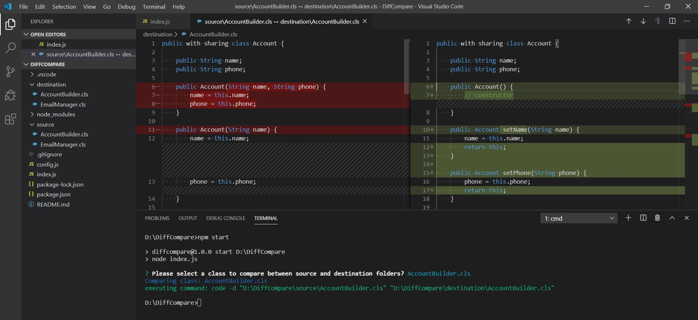

# DiffCompare
Used for comparing two files under the configured directory

# Notes

1. VSCode must be installed on the computer and `code` command must be available; as this utility launches VScode diff from CLI for comparison, example of command is as below.
  code -d "sourcePath" "destinationPath"
2. Custom file path and list of files can be configured in config.js, for demo purpose `source` and `destination` folder is being added along with 2 files in both of them.
3. Tool uses the `inquirer` npm package to prompt user with available options.

# Start

1. Clone the repository and from command line navigate to the root folder containing package.json
2. Run `npm install` to install the dependencies locally, at the moment which is inquirer.
3. Run `npm start` to start the application.
4. Select one of the option and enter, this will execute the diff command to start the vscode with file comparison.

---

